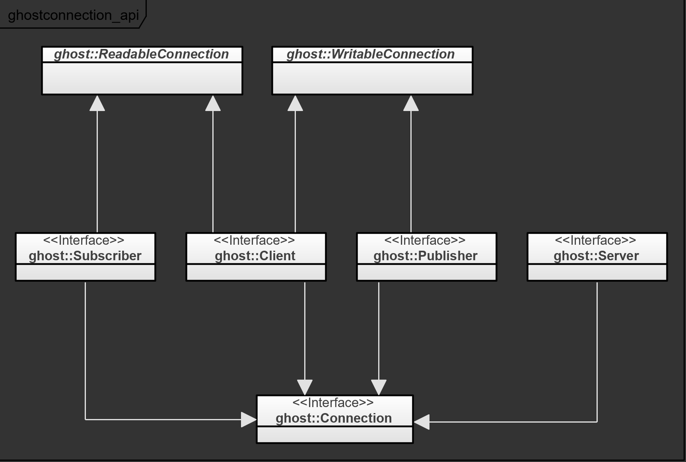
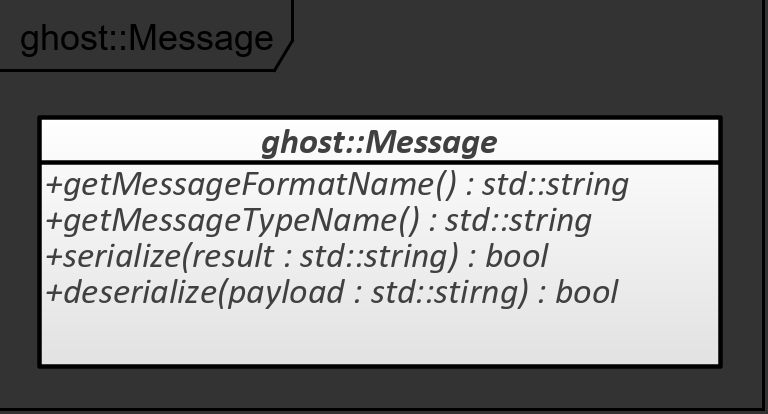

After ghost_module, the second major pillar of the Ghost framework is its connection library: ghost_connection. This guide introduces the library's end-user concepts:

- Integration into the Ghost framework;
- Different connection types;
- Configuration of connections;
- Message format;
- Reader and Writers;
- Underlying connection technology.

## Connection Extension

### Feature Description

ghost_connection / ghost_connection_extension is an extension for ghost::Module. Its entry point is represented by the class ghost::ConnectionExtension, which can be built by a ghost::ConnectionExtensionBuilder during the module's configuration phase ([See the ghost_module guide](module.md) for a detailed explanation of a module's lifetime).

In particular, the ghost::ConnectionExtension exposes an instance of the ghost::ConnectionManager class, which owns all the connections in a program.

## Connection Types

### Feature Description

In the Ghost framework, connections can be of the following types:

- Server / Client (represented by ghost::Server and ghost::Client). This pair represents a bi-directional communication interface

  The ghost::Client interface is used both on the client side (triggering the call) and on the server side. In the latter case, the client object representing the active connection with the peer client.

- Publisher / Subscriber (represented by ghost::Publisher and ghost::Subscriber). This pair represents a one-directional (publisher to subscriber) connection.

All connections also inherit from the ghost::Connection interface which exposes lifetime operations such as `start()`, `stop()` and `isRunning()`.

The following diagram shows the class hierarchy of the different types of connections:

## Connection Configuration

### Feature Description

Depending on the underlying technology of the ghost::Connection interface implementations, different configuration parameters may be required. The class ghost::ConnectionConfiguration therefore contains a key/value association that accepts multiple types of parameters.

The configuration is provided to the ghost::ConnectionManager in order to create connections.

A notable parameter of connection configurations is the blocking mode. It is available through the getters and setters `isOperationBlocking()` and `setOperationBlocking()`. A blocking connection typically blocks the current thread when reading or writing a message. This configuration value should be set wisely depending on the application's requirements.

## Message Format

### Feature Description

ghost_connection uses Google Protobuf as the message transport format. All connections therefore natively accept any Protobuf message type.

On top of that, Users have the possibility to define their own message format. In order to send and receive messages with a customized format, the type of the messages must implement the ghost::Message interface. The interface requires the following elements:

- the name of the format as a string;
- the name of the type of message;
- an implementation of a `serialize()` method capable of deterministically convert the message to a string;
- an implementation of a `deserialize()` method capable of parsing a string of the same format name.

The following class diagram illustrates the interface content:

## Reading Messages From a Connection

### Feature Description

Subscribers and clients are the two types of connections that can read from their peer. The classes ghost::Subscriber and ghost::Client therefore both inherit from ghost::ReadableConnection, which provides features to read and process messages:

- a message handler (ghost::MessageHandler) can be set on the connection to process incoming messages of any type as they arrive (asynchronously);
- a reader object (ghost::Reader) that can be used to read incoming messages from a given type from the connection (synchronously).

The two features are mutually exclusive: if a message handler is set to the connection, subsequent calls using a reader fail (otherwise the connection could not know which features shall process incoming messages).

## Writing Messages From a Connection

### Feature Description

Similarly to the ghost::ReadableConnection interface, connection types that allow sending messages inherit the ghost::WritableConnection. Only ghost::Publisher and ghost::Client objects can send messages (a ghost::Server is neither a writable nor a readable connections). A ghost::Writer object can be created from a ghost::WritableConnection in order to send messages of a given type.

## Connection Technology

### Feature Description

The connection library is a generic message transporting system: the interfaces are technology-agnostic in order to replace the underlying connection implementation without refactoring the microservices. For example, the server / client connection used by a user of the ghost_connection library can switch from a network implementation, a program-intern routing or a mocked connection by simply modifying a few lines in the configuration code of the ghost::Module.

In order to achieve such a genericity, the ghost::ConnectionManager possesses a ghost::ConnectionFactory which is responsible for generating ghost::Connection objects with the proper technology. Users must therefore configure the connection factory with connection rules, which associate specific connection configurations (represented by a ghost::ConnectionConfiguration object) to the desired implementation. ([See this guide](connection_extensions.md) for more information about the connection factory system).

The ghost framework provides an implementation of the ghost_connection library based on Google gRPC: ghost_connection_grpc.