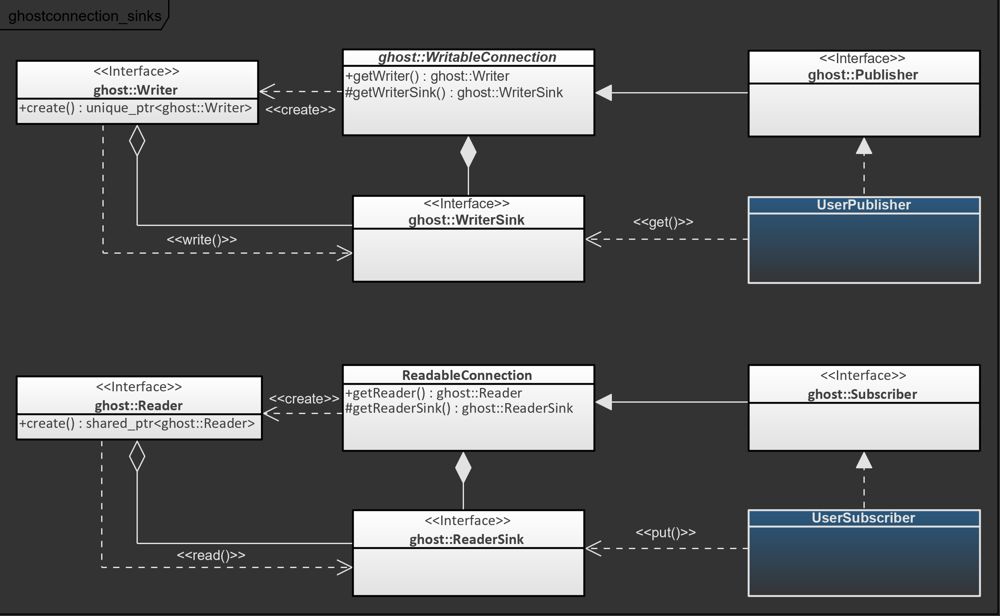

As described by the ghost_connection guide ([Read it here](connection.md)), the library exposes a generic communication structure. In order to use it, Users must provide an implementation of the ghost::Connection interfaces that matches their requirements. The implementation depends on the technology needed and could be as diverse as a local program communication or a networked connection over a MQTT system. The ghost framework provides a ready-to-use extension based on Google gRPC.

In this guide, the following two points are explained:

- The mechanisms of the ghost::ConnectionFactory, responsible for the creation of the connections;
- The message pipeline of a connection and how to use it.

## Providing Connection Technologies to ghost_connection: ghost::ConnectionFactory

### Feature Description

The ghost::ConnectionManager creates ghost::Connection objects with the help of the ghost::ConnectionFactory, whose responsibility is to create connection objects with the correct underlying implementation. The factory possesses rules which associate a templated type to a configuration model. When a connection configuration is provided to the connection manager, the corresponding factory rule is searched. If all the fields of the rule's configuration model are defined in the provided user configuration, then the factory rule is selected to build the ghost::Connection.

Integrating new communication technologies into ghost_connection therefore consists in the following steps:

- define a minimum configuration that all requests to the ghost::ConnectionManager must fulfill in order to use the new implementation;
- Register the classes implementing the ghost::Connection interfaces to the ghost::ConnectionFactory.

### Usage

The ghost::ConnectionFactory is available as soon as the ghost::ConnectionExtensionBuilder is created by retrieving the ghost::ConnectionManger from the builder and calling its `getConnectionFactory()` method. The factory can be extended at any time after this point.

In order to register new factory rules, the ghost::ConnectionFactory exposes four template methods: `addServerRule()`, `addClientRule()`, `addPublisherRule()`, `addSubscriberRule()`. The template parameter of the method must be the implementation class realizing the ghost::Connection interfaces (e.g. `addServerRule()` accepts a template parameter that realizes the interface ghost::Server).

For example, the Ghost library ghost_connection_grpc provides an implementation of the four connection types using Google gRPC. The library also defines a specific configuration class named ghost::ConnectionConfigurationGRPC, which is registered as the minimum configuration necessary to create connections using this implementation (This registration is done by the class ghost::ConnectionGRPC).

## Developing a New Connection Technology

### Feature Description

Each connection type exposed by ghost_connection extends the ghost::Connection interface which provides methods for the lifetime of connections, but also a reader or writer interface, as described in the ([ghost_connection guide](connection.md)). ghost::ReadableConnection and ghost::WritableConnection expose both the consumer side (e.g. a `write()` method on a publisher to send messages to subscribers) and the producer side of the connection (e.g. a method to push received messages into the connection object for a subscriber).

The producer side of readable connections is represented by a ghost::ReaderSink. This class exposes a `put()` method that must be used in order to provide received messages to a ghost::Client or ghost::Subscriber. If users of the connection registered a ghost::MessageHandler, calling `put()` will directly pass the message to the User's handler method. The return value of the `put()` method can be used to determine whether the connection has been closed or not.

A similar feature exist for writable connections. ghost::WriterSink exposes a `get()` method that provides a message if Users of the connection called `write()` on an ghost::Writer associated to this connection. A timeout may be configured in order to parameterize the blocking/non-blocking behavior of the implementation. Once the message is processed (e.g. sent through the implemented communication technology), the message must be removed by calling the sink's `pop()` method.

Both ghost::ReaderSink and ghost::WriterSink are accessible through protected methods of the ghost::ReadableConnection, resp. ghost::WritableConnection. The sinks are therefore available to the implementation, but not to the Users of the connection interfaces.

The following diagram illustrates the data flow in the class hierarchy of publishers and subscribers. The classes in blue represent the implementation of the actual communication. The sinks are made available to the implementation, while the user is able to create writer/reader objects.

### Usage

Developing a new connection technology therefore consists in creating an implementation for the connection interfaces ghost::Publisher, ghost::Subscriber, ghost::Server and ghost::Client. In particular the implementation is responsible for the following:

- open a communication channel between a ghost::Server and a ghost::Client, or between a ghost::Publisher and a ghost::Subscriber;
- for ghost::Publisher and ghost::Client (implementing ghost::WritableConnection): get messages from user calls through the sink's `get()` method and actually send the messages;
- for ghost::Subscriber and ghost::Client (implementing ghost::ReadableConnection): read messages from the communication channel and push the results through the sink's `put()` method;
- manage the lifetime of the connection by defining and implementing a starting and stopping behavior.

*Note: you can analyze the implementation of the ghost_connection_grpc library as an example of this guide. The library integrates Google gRPC to send the messages available in ghost::WriterSink objects and put received messages into ghost::ReaderSink objects.*