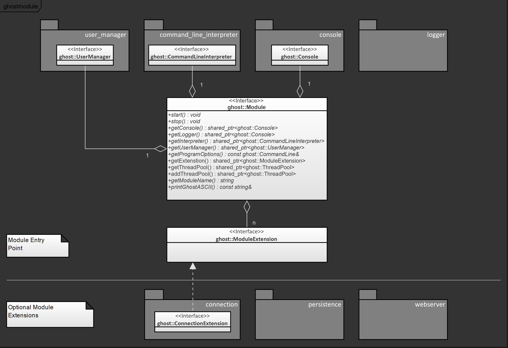

This document provides an overview of the core library of the ghost C++ microservice framework: ghostmodule.

## Overview

ghostmodule is organized around the central class ghost::Module, whose responsibility is to expose the microservice's components to the rest of the system. Instances of this class can be passed through a user code's implementation and serve as dependency injection mechanism.

The following diagram represents the API interface ghost::Module surrounded by the components that it exposes.

### Built-in components

ghost::Module exposes several components that every microservices generally use:

- *Module Lifetime Management*: the execution of a module goes through the following phases: configuration, initialization, runtime and disposition. The configuration phase is supported by the class ghost::ModuleBuilder, which is used to parameterize the following steps. Once the module is started, its state can be accessed from the created ghost::Module, which can be started and stopped.
- *Observability mechanisms*: multiple components offer options to observe the state of the microservice:
  - a logging interface (ghost::Logger) can be configured to generate and display service logging;
  - a console utility (ghost::Console) takes control of the terminal to allow user input;
  - a command line interpreter (ghost::CommandLineInterpreter) can be initialized with user-made commands in order to monitor application specific data;
  - a user manager (ghost::UserManager) manages permissions of observability tasks.

### Module Extensions

ghostmodule provides the possibility to integrate second or third-party components into ghost::Module. Integrated components benefit from the lifetime management functionality (they are started and stopped by the module, and may use shared or managed thread pool (see ghost::ThreadPool)).

As parts of the ghost framework, the following extensions are provided:

- *the connection library*: contains a ghost::ModuleExtension that manage connections in a generic form. The library provides server/client and publisher/subscriber interfaces as well as ways to read and write from them. It exposes an entry point (ghost::ConnectionManager) that can be used to configure the underlying communication technology.
  - currently, an integration of Google gRPC is implemented in the ghost framework.
- *the persistence library*: most microservices persist data on the disk or use a database to store their data. The ghost framework provides a library (ghost_persistence) that does just that.
  - currently, the persistence library offers the possibility to store data in a local file (ghost::SaveManager).
  - Planned: integration of MongoDB databases
- *Planned: ghost webserver*: as an optional observability mechanism, the ghost framework will provide a webserver in order to visualize the health of the services and their data in a browser.