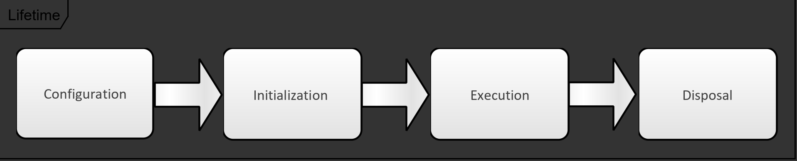

This document provides a general description of the core library of the ghost C++ microservice framework: ghostmodule.

## Overview

ghostmodule is organized around the central class ghost::Module, whose responsibility is to expose the microservice's components to the rest of the system. An instance of this class can be passed through a user code's implementation and serve as dependency injection mechanism.

The following diagram represents the API interface ghost::Module surrounded by the components that it exposes.

### Built-in components

ghost::Module exposes several components that every microservices generally use:

- *Module Lifetime Management*: the execution of a module goes through the following phases: configuration, initialization, runtime and disposition. The configuration phase is supported by the class ghost::ModuleBuilder, which is used to parameterize the following steps. Once the module is started, its state can be accessed from the created ghost::Module, which can be started and stopped.
- *Observability mechanisms*: multiple components offer options to observe the state of the microservice:
  - a logging interface (ghost::Logger) can be configured to generate and display service logging;
  - the console utility (ghost::Console) takes control of the terminal to allow user input;
  - the command line interpreter (ghost::CommandLineInterpreter) can be initialized with user-made commands in order to monitor application specific data;
  - the user manager (ghost::UserManager) manages permissions of observability tasks.

### Module Extensions

ghostmodule provides the possibility to integrate second or third-party components into ghost::Module. Integrated components benefit from the lifetime management functionality (they are started and stopped by the module, and may use a shared or managed thread pool (see ghost::ThreadPool)).

As parts of the ghost framework, the following extensions are provided:

- *the connection library*: contains a ghost::ModuleExtension that manage connections in a generic form. The library provides server/client and publisher/subscriber interfaces as well as ways to read and write from them. It exposes an entry point (ghost::ConnectionManager) that can be used to configure the underlying communication technology.
  - currently, an integration of Google gRPC is implemented in the ghost framework.
- *the persistence library*: most microservices persist data on the disk or use a database to store their data. The ghost framework provides a library (ghost_persistence) that does just that.
  - currently, the persistence library offers the possibility to store data in a local file (ghost::SaveManager).
  - Planned: integration of MongoDB databases
- *Planned: ghost webserver*: as an optional observability mechanism, the ghost framework will provide a webserver in order to visualize the health of the services and their data in a browser.

## Module Lifetime

The life of a module goes through several stages, which are listed in this section.

### Phase 1: Configuration

This phase generally happens in the main function of the executable. An instance of a ghost::ModuleBuilder is created, and is used to add and configure the components of the module. In particular, the methods `setInitializeBehavior()`, `setRunningBehavior()` and `setDisposeBehavior()` exist to set the functions to execute during the respective phases of the module.

Extensions can be added to a module by calling the method `addExtensionBuilder()` of the module builder. It expects a builder for extensions as parameter, which will be called when the module is built.

At the end of the configuration, the builder's `build()` method is called to generate the module. If the configuration is valid, this method returns an instance of a ghost::Module, which can be finally be started by a simple call to its `start()` method.

### Phase 2: Initialization

Once start() is called, the module starts initializing. This phase is dedicated to setting up database connections, establishing network connections or any other operations that need to be done before a microservice is considered "running". The order of the initialization of the module is as follows:

- The thread pools start: per default the module has one ghost::ThreadPool. It is possible to add application-specific thread pools during the configuration phase. All configured thread pools are started first (so that they can be used by the other components as soon as possible);
- If a ghost::Console is set, it is started;
- If `setInitializeBehavior()` was called during the configuration, the function given in the parameter list is called;
- All extensions configured in the first phase by calls to `addExtensionBuilder()` are started: the method `start()` of the created ghost::ModuleExtension is called.

If the initialization fails, then the module is stopped. If the initialization fails during or after the user initialization is called, then the module's `stop()` method is called to give a chance to the User to clean up the module.

If the initialization succeeds, then the next phase starts.

### Phase 3: Execution

The next phase is the actual execution of the module. This phase consists in the repeated execution of the function provided at the configuration phase with `setRunningBehavior()`. The provided function must return a Boolean value, which determines whether the execution must continue (true), or if the module can switch to the next phase (false).

### Phase 4: Disposal

Finally, the module de-initializes and stops. This phase happens if either one of the following conditions is met:

- the running behavior returned false;
- the module's stop() method is called;
- the command line "exit" was entered in the ghost::Console (if activated).

On disposal, the following actions are done:

- If `setDisposeBehavior()` was called during the configuration, the function given in the parameter list is called;
- All extensions are stopped: the method stop() of ghost::ModuleExtension is called;
- If a ghost::Console is set, it is stopped;
- The thread pools are stopped. This operation is performed last to prevent hanging executions from disposing the module. All applications using the thread pool must stop their execution during the previous disposal executions (either during the dispose behavior or as part of the module extension stop method).

Note: calling `start()` on the ghost::Module is a blocking operation. It will only return when the module disposed. All code written after `start()` will therefore be executed after the disposal phase is completed.