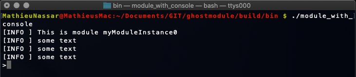
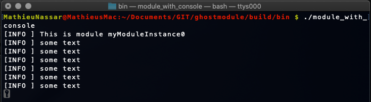
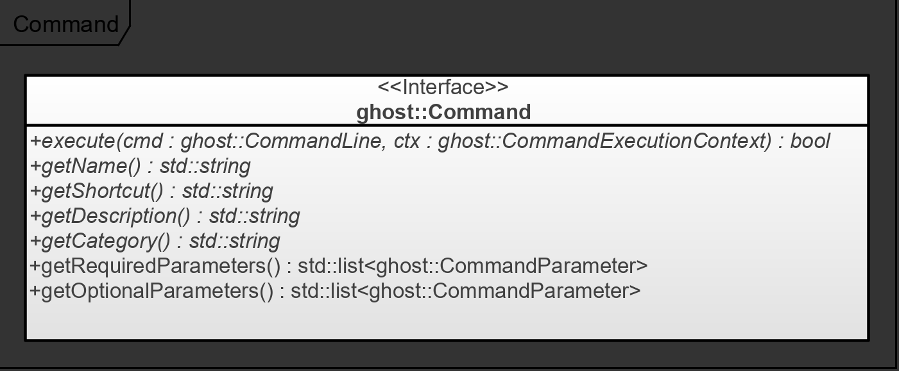

In this guide, the built-in features of ghostmodule that enable microservice observability are described. The ability to observe the state of a microservice, and possibly interact with it, is an important functionality that can serve multiple purposes such as monitoring, debugging, commissioning or manual operation.

The Ghost framework provides the following components:

- A Logger interface (ghost::Logger);
- the console utility (ghost::Console);
- the command line interpreter (ghost::CommandLineInterpreter);
- a user manager including session management (ghost::UserManager).

## Logging Interface

### Feature Description

A very simple interface logging interface can be set via the ghost::MobuleBuilder during the configuration phase of the microservice. The interface provides five methods to log information at different levels:

- `error()`: feed an error description to the underlying system;
- `warn()`: use this method to indicate that unexpected activity is happening, but no error has occurred yet
- `info()`: prints information about the current operations in the microservice
- `debug()`: writes information that helps analyzing issues and bugs
- `trace()`: most granular type of information, that may also be logged cyclically

The actual implementation is also determined during the configuration phase. ghostmodule exposes two implementations of simple loggers:

- ghost::StdoutLogger: simply prints the content with std::cout with a prefix depending on the information level;
- ghost::GhostLogger: also prints the content to the console, but using the ghost::Console utility, which is described in the next section.

In order to develop specific or more extensive implementations of the ghost::Logger, Users are required to inherit from the interface and implement the corresponding virtual methods.

### Usage

The logger is accessible from the ghost::Module entry point class. In order to write log lines, a few C++ defines exist to make the calls more recognizable and readable. Writing an info log line is done the following way:

`GHOST_INFO(module->getLogger()) << "This is a log line in " << 2020;`

Writing trace, debug, warn and error logs are achieved by replacing the "INFO" letters by the respective matching capital letters.

## Console Utility

### Feature Description

The console utility solves the following problem: how to display log information and expect user input at the same time? The solution implemented by ghost::Console is the following.

The module framework has two console states: Input and Output. While the state is Output, the microservice prints log information. On the contrary, during the Input state, the console saves the output log lines while it expects the User to provide some input. Once the User is finished providing input, the saved log lines are displayed and logging is resumed.

In order to switch from Output to Input, it is simply necessary to press the "Enter" key. A prompt string is then displayed to indicate that the mode is now Input.

##### Activating the Console

Pressing Output again will have the following effect:

- if nothing has been written in the Input mode, then the mode is switched to Output;
- if something has been written in the Input mode, then a command is submitted to the module, and:
  - per default, the mode is switched to Output;
  - if configured, another command is expected by the user.

The following two pictures illustrate an example module in which the mode is Input (top), and in which it is Output (bottom)

##### Input Modes

During the configuration phase of the microservice, it is possible to set the ghost::InputMode of the console to the following values:

- SEQUENTIAL: once the Input mode is activated, it will only be deactivated by pressing the "Enter" key without writing a command. As a result, Users do not need to switch to the Input mode again in order to provide a sequence of commands.
- DISCRETE: **(Default)** after a command is provided, the console mode is automatically switched back to Output. Hence, in order to write multiple commands, it is necessary to activate the Input mode before each command.

### Usage

If this functionality is necessary in a project, the console must be explicitly activated during the configuration phase of the microservice. For this purpose, the ghost::ModuleBuilder provides the `setConsole()` method. This call sets up a ghost::Console object and returns it, so that it can be configured.

*Note: at this point, the console is not active: it will be started during the initialization phase of the ghost::Module. Users may however start the console earlier by calling `start()` on the retrieved console object.*

During the configuration of the console, the following parameters can be configured:

- the ghost::InputMode, as mentioned above;
- the format of the prompt, that is displayed when the Input mode is activated
- a callback to call when a new command is provided (per default, the ghost::Module registers a callback to links the user input to the ghost::CommandLineInterpreter)

## Command Line Interpretation

### Feature Description

One possible usage of the console is to interpret user input as command lines and execute them. The default routing of a ghost::Console in a ghost::Module forwards the lines entered by the User to the module's instance of ghost::CommandLineInterpreter. It effectively calls the interpreter's method `execute()` with a line that is provided by the ghost::Console callback mechanism.

Prior to the execution phase, it is possible to configure the interpreter with custom commands by calling the interpreter's method `registerCommand()`. While registering new commands, it is also possible to restrict their access to a specific set of registered users: this feature is introduced in the next section.

A few commands are pre-loaded in the interpreter:

- exit: stops the module, triggering a graceful shutdown of its components (the module switches to the Disposal phase);
- help: displays a list of available commands including a description string;
- login: requests a username and a password from the User and attempts to log them into the user manager.

### Usage

Commands are represented by instances of classes realizing the ghost::Command interface, illustrated hereunder. It provides the interpreter with several information which are used to document the commands, as well as the `execute()` method that is called by the interpreter once a matching command is received and parsed.

The shortcut field represents the string that identifies the command and needs to by typed by the user to activate it. The name, description and category strings are used by the "help" command to sort and list the available commands. Finally, the required and optional parameters lists are used to generate a usage string (for documentation purpose). Additionally, those two lists serve as preconditions for the execution of the commands. A missing required parameter prevents the execution of the command.

## User Permissions Management

### Feature Description

In some situations it is preferrable to restrict the access of some commands to some priviledged users, such as experienced operators.

##### Users and Groups

The ghost::UserManager component allows microservice developers to create users and groups of users, so-called "permission entities", ghost::PermissionEntity). The user manager can then be used in combination with the command interpreter to set up permissions to the commands. This happens during calls to the interpreter's `registerCommand()` method.

Similarly to a *nix system, users may belong to groups. This affects in particular the command line interpreter: restricting a command to a user group allows every user of this group to execute the command.

##### User Session and Login System

When a user executes a command, the `execute()` method of the ghost::Command is called with an object of type ghost::CommandExecutionContext. The context contains the ghost::Console that triggered the execution (it can be used to read and write lines), and a ghost::Session object that can be used to keep track of the user.

In order to execute user-restricted commands, a user of the microservice must first login into the user manager, with a login and a password that has been predefined by the developers of the application. The `connect()` method of the ghost::UserManager expects a ghost::Session object, which will be associated with the user who just connected. The same session will be re-used for every call made by the same ghost::Console object and can therefore be used as a key to associate data to a specific session.

### Usage

The ghost::UserManager can be first accessed during the initialization phase of the ghost::Module (after it has been built with a ghost::ModuleBuilder). During this phase, users and groups can be added by calling the methods createUser(), createUserGroup() and addUserToGroup().

*Note: A default user is added with username "superuser" and password "superuser".*

Per default, a login command is registered in the command interpreter. This command requests a username and a password from the console and attempts to connect the user to the ghost::UserManager.

*Note: commands can be overridden by registering a new command with the same shortcut (the return value of ghost::Command::getShortcut is identical).*