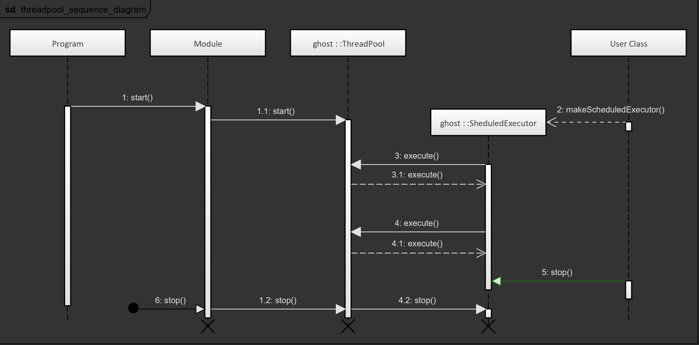

The Ghost framework is designed to enable single-threaded applications as well as programs with task parallelization potential.

### Feature Description

The main actor of the threading concept is the class ghost::ThreadPool, exposed by the library ghostmodule. Instances of this class are created and managed by the ghost::Module instance itself. Like its name suggests, the thread pool runs a number of threads that are dedicated to the execution of diverse tasks in the module.

##### Scheduling Single Tasks

The most basic functionality of the thread pool is to accept tasks from the User and execute them. Tasks are provided as a template parameter to ghost::ThreadPool's `execute()` method that must be a callable type: an std::function, a lambda, or the result of a call to std::bind. The `execute()` method returns an std::future object that contains the return value of the task. Once accepted, the task is enqueued for execution and available threads in the pool will take care of it.

*Note: the thread pool only executes tasks once started (by either calling `start()` or by starting the ghost::Module that manages the pool).*

##### Scheduling With Fixed Rate

A common use-case for microservices is to check the state of a variable or any other entity and act. While a dedicated thread could be allocated to that task and wait for a state change, in most cases it is more resource-efficient to schedule this check with a fixed rate. By doing so, a single thread could take care of several similar tasks, hence saving thread resources to the program and increasing its performance and scalability.

The ghost::ThreadPool exposes for this purpose the class ghost::ScheduledExecutor, which can be constructed from a call to ghost::ThreadPool's `makeScheduledExecutor()` method. Analogously to its Java counterpart, ghost::ScheduledExecutor provides a method called `scheduleAtFixedRate()`, that expects a task and a desired execution rate. This method has the following restrictions:

- the tasks may not return a value (its return type must be void);
- if the task takes longer to execute than the commanded execution rate, then the next task is delayed: the task is not executed concurrently.

##### Lifetime

ghost::ThreadPool objects are always owned by a ghost::Module instance. Although they possess a `start()` and a `stop()` method, it is not necessary to call them: the lifetime of the thread pools follows that of the module.

At the beginning of the initialization phase, the module calls `start()` on all the thread pools that have been added at the configuration phase. This ensures that the pools are ready to execute tasks before the user-provided initialization behavior is called.

At the end of the disposal phase, the module calls their `stop()` method. Stopping the pools is the last operation done by the module before it ends, because user code and ghost::ModuleExtensions may be relying on the thread pool to finish their operation. The disposal behavior is therefore the best time to stop and finalize the components, so that no dead locks / starvation situation occur.

*Important note: all the tasks that are operating on class members must complete before the destructor of the corresponding classes is called. Otherwise segmentation faults may occur! For this purpose, please always stop executors and await the completion of open tasks before the destructor ends by either calling the `stop()` method of the executors or by waiting for the std::future that is returned by the pool's `execute()` method.*

The following sequence diagram illustrates the typical runtime of a module. On the right side, a "User class" makes use of the ghost::ThreadPool to create a scheduled executor to perform periodic calls [2]. Note that the "user class" calls `stop()` [5] on the ghost::ScheduledExecutor before the module exits (the green arrow).

##### Yielding the Execution

It may happen that an implementation needs to wait for the completion of another task before continuing its execution. In these cases, the options are usually to use a condition variable and pause the thread's execution, or to have a sleep behavior that also blocks the thread. The threading concept of the Ghost framework brings a third option, which is offered by ghost::ThreadPool's `yield()` method: calling this method will execute jobs enqueued in the thread pool for at least the provided duration instead of wasting CPU time waiting.

##### Single-Threaded Programs

It is possible to use the ghost::ThreadPool in a single-threaded program. To achieve this configuration, it is simply necessary to call the pool's `resize()` method with a size of zero. In this case, no threads will be started, and the only worker available is the ghost::Module itself. In this use-case, the enqueued tasks are executed sequentially by the main thread.

*Note: blocking a thread with a single-threaded configuration obviously causes the whole program to block. Therefore it is always recommended to yield execution with ghost::ThreadPool's `yield()` method instead of sleeping.*

### Usage

Every ghost::Module possesses at least one thread pool which is created by default. The configuration of existing thread pools or adding new thread pools can be done at any stage of the lifetime of the module. Existing thread pools are automatically started at the beginning of the initialization phase of the module (prior to the execution of the configured initialization behavior). Thread pools created after this phase must be manually started by calling their `start()` method.

In order to create a new thread pool, the ghost::ModuleBuilder and ghost::Module expose the method `addThreadPool()`, which expects a name used to retrieve the pool and the pool's target size.

In order to retrieve an existing thread pool from the module, both ghost::ModuleBuilder and ghost::Module provide a `getThreadPool()` method that expects the name of the pool to retrieve. Providing an empty string (which is the default parameter) returns the default thread pool, which is used to execute the module's running behavior and the built-in routines (e.g. the console tasks).